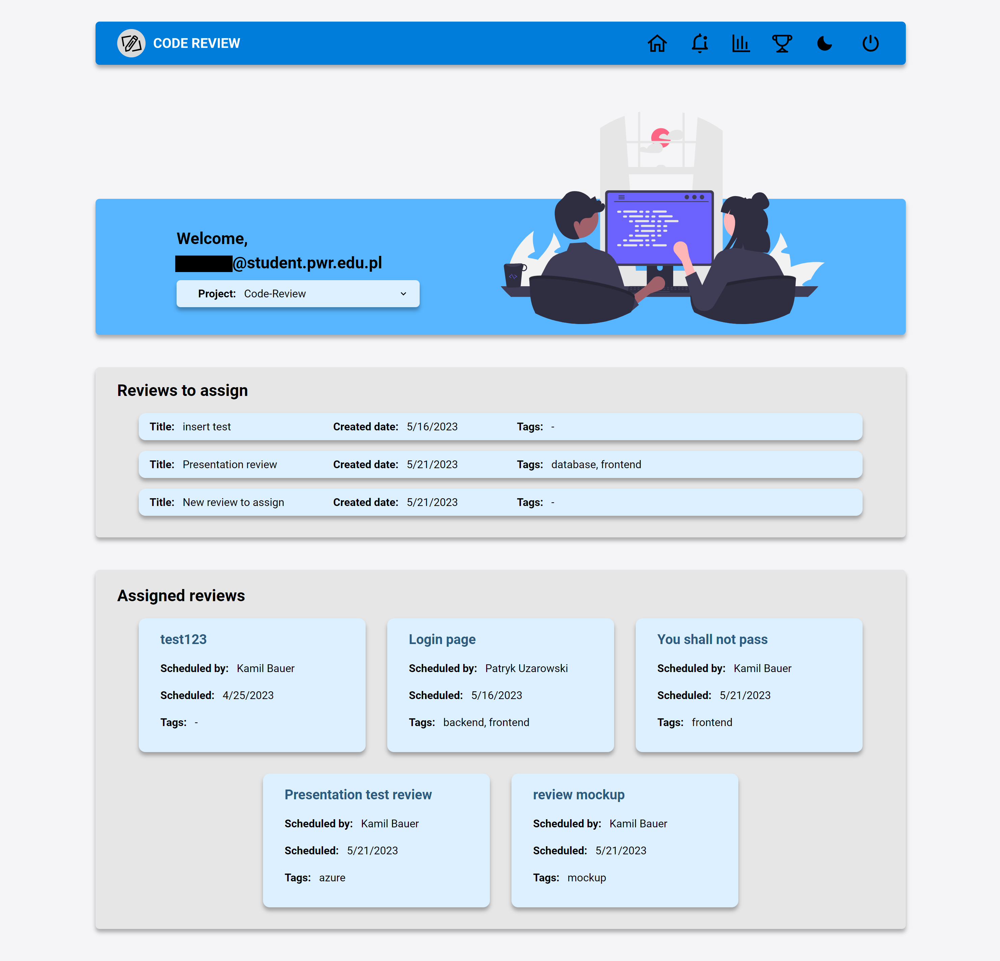
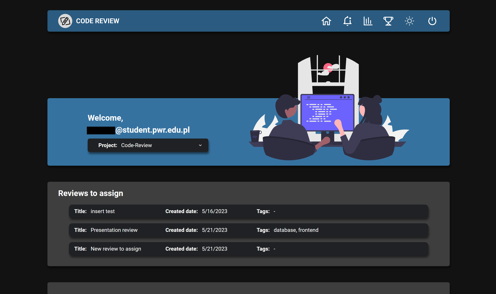

# A system to streamline the code review process in a development team


### Table of contents
* [General info](#general-info)
    - [Features](#features)
* [Backend](#backend)
    - [Build and run the app](#build-and-run-the-app-backend-directory)
    - [Config file structure](#current-envproperties-file-structure)
    - [Requirements](#requirements-backend)
* [Frontend](#frontend)
    - [Run application](#build-and-run-the-app-frontend-directory)
    - [Config file structure](#current-env-file-structure)
    - [Requirements](#requirements-frontend)
* [Docker](#docker)
    - [Create docker container](#create-docker-container)
    - [Configurations](#configurations)
    - [Config file structure](#env-file-structure)
    - [Requirements](#requirements-docker)
* [Authors](#authors)
* [Screenshots](#screenshots)

## General info

The Code Review project is a system designed to enhance and optimize the code review process within a development team.

This system aims
to improve the efficiency of the code review process by providing automated reviewer suggestions for pull requests
and sending reminders to users regarding pending code reviews.
The system also provides a set of statistics
that can be used to analyze the code review process and improve it in the future.

The system works as an Azure DevOps VCS extension. It consists of two parts:
- Backend application (Java with Spring Boot framework).
- Frontend application (TypeScript with ReactJS framework).

This project was created for Wrocław University of Science and Technology's [Team Projects Committee 2023](https://kpz.pwr.edu.pl).

### Features
- Automated reviewer suggestions for pull requests based on availability.
- Code reviewers assignment to pull requests.
- Automated notifications and reminders about pending code reviews.
- Code review statistics and leaderboards.

## Backend

### Build and run the app (`backend` directory)
- Clean build of backend application.
```
./gradlew clean build
```
- Default run, active profile set in application.properties file - "spring.profiles.active=..." variable.
```
./gradlew bootRun
```
- Run config with direct profile within instruction, here "test".
```
./gradlew bootRun --args='--spring.profiles.active=test'
```

### Current env.properties file structure
```
SPRING_DATASOURCE_USER={exampleUser}
SPRING_DATASOURCE_PASSWORD={examplePassword}
SPRING_DATASOURCE_URL:postgresql://{exampleHost}:5432/{exampleDatabase}
SPRING_DATASOURCE_TEST_URL=jdbc:h2:mem:{exampleDatabase}
SPRING_AZURE_ACCESS_TOKEN={exampleToken}
SPRING_ORGANIZATION_NAME={exampleOrganizationName}
SPRING_CLIENT_URL={exampleClientUrl}
SPRING_REFRESH_TOKEN_EXPIRATION_DAYS={exampleDays}
SPRING_ACCESS_TOKEN_EXPIRATION_MINUTES={exampleMinutes}
```

### Requirements (backend)
- Java @17
- Gradle @7.6.1 (optional)
- .env.properties file in `backend/src/main/resources`

## Frontend

### Build and run the app (`frontend` directory)
- Install required dependencies.
```
npm install
```
- Run application.
```
npm start
```

### Current .env file structure
```
REACT_APP_BASE_URL={REACT_APP_BASE_URL}
REACT_APP_ENV={REACT_APP_ENV}
```

ENV_PROFILE may be one of the following:
- DEV - development profile 
- TEST - test profile with disabled security
- PROD - production profile

Instead of __.env__ file you can use __.env.local__, which will be ignored by git.

### Requirements (frontend)
- node.js @16.18 ([nvm](https://github.com/nvm-sh/nvm) suggested)
- npm @7.10
- .env file in `frontend`

## Docker

### Create docker container
To create and run container, use command:
```
docker-compose up -d
```
- -d flag is optional and runs container in the background.

### Configurations
While deploying the app using docker, local __.env__ (frontend) and __.env.properties__ (backend) files are ignored.
__.env__ file in `deploy` directory is used instead.

#### __.env__ file structure
```
BACKEND_PORT={BACKEND_PORT}
FRONTEND_PORT={FRONTEND_PORT}
DATABASE_PORT={DATABASE_PORT}
DATABASE_NAME={DATABASE_NAME}
DATABASE_USER={DATABASE_USER}
DATABASE_PASSWORD={DATABASE_PASSWORD}
ORGANIZATION_NAME={ORGANIZATION_NAME}
REFRESH_TOKEN_EXPIRATION_DAYS={REFRESH_TOKEN_EXPIRATION_DAYS}
ACCESS_TOKEN_EXPIRATION_MINUTES={ACCESS_TOKEN_EXPIRATION_MINUTES}
AZURE_ACCESS_TOKEN={ACCESS_TOKEN}
```

__.env__ file is required to run the container and should be placed in `deploy` directory, where docker-compose.yml file is located.

### Requirements (Docker)
- Docker installed
- Docker daemon running
- Docker compose installed
- .jar file with backend application
- .env file in `deploy` directory

## Authors
- [Kamil Bauer](https://www.linkedin.com/in/kamil-bauer-678392239/)
- [Damian Gnieciak](https://www.linkedin.com/in/damian-gnieciak-057a50207/)
- [Igor Stalmach](https://www.linkedin.com/in/igorstalmach/)
- [Kacper Aleks](https://www.linkedin.com/in/kacper-aleks-2b0585266/)
- [Patryk Uzarowski](https://www.linkedin.com/in/patryk-uzarowski-764b26238/)

## Screenshots
- Home screen of the app.




- The app is also available in dark mode.

